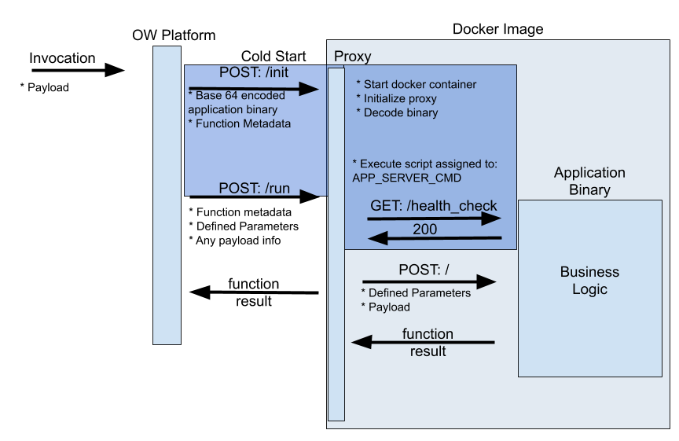

# Openwhisk Custom Container with Reverse Proxy

This project is an example for deploying a function on Apache Openwhisk using a custom docker image.

## Motivation

This approach would be used when:

1. The function would exceeds Openwhisk's size limit of 48 MB. 

	**Note:** The size limit is a bit "fuzzy" as Openwhisk Base64 encodes binaries, so a Java .jar that is ~30MB might when encoded exceed the 48 MB limit.

2. You have proprietary code in a public location as Openwhisk requires container images to be hosted on a public DockerHub.

## Project Overview

The function in this example is a simple batch application that performs ETL. It reads from a S3 Bucket ([IBM Cloud Object Storage](https://www.ibm.com/cloud/object-storage)), performs light transformation, and loads to a XAP gigaspaces instance hosted on IBM Cloud.

The function executes based on a trigger, which supplies the info to look up the item added to the S3 bucket. 

The function only returns status about the success of the function execution.

Installing XAP on a Kubernetes: https://docs.gigaspaces.com/xap/14.0/admin/kubernetes-data-grid.html

## Function Flow

Below is a flow chart of the overall flow of the function from the perspective Openwhisk. Any business logic/behavior is blackboxed in the application binary and not described here.

`ibmcloud resource service-key-create creds_aa-cos Manager --instance-name aa-cos`

`ibmcloud fn service bind cloud-object-storage aa-functions --instance aa-cos --keyname creds_aa-cos`

mvn clean install 
zip -d target/aa-serverless-function.jar "BOOT-INF/lib/*" 
docker build . -t aa-serverless:demo-spring35 
docker push wkorando/aa-serverless:demo-spring-35
ibmcloud fn action update trigger-test target/aa-serverless-function.jar --docker wkorando/aa-serverless:demo-spring-35